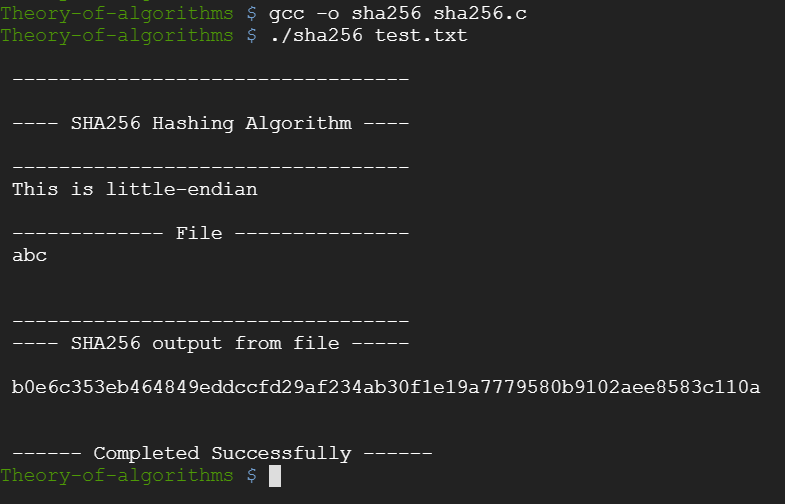

## SHA256 Algorithm in C
You must write a program in the C programming language that calculates the SHA-256 hecksum of an input. The algorithm is specified in the Secure Hash Standard
document supplied by the (United States) National Institute of Standards and Technology. The only pre-requisite is that your program performs the lgorithm — you are free to decide what input the algorithm should be performed on. I suggest you allow the user to input some free text or a filename via the
command line.

## Compiling
For creating this program I used the Google Cloud platform and created an
Instance on my machine to create the algorithm.

If you wish to compile and run thus program you must do the following:
- get a clone of this repo to your desired destination
- cd Theory-of-algorithms
- In order to compile this program the GCC compiler must be installed on your
  device which is why we opted to use an instance on Google Cloud
- Run the command "gcc -o sha256 sha256.c" in the terminal(or CMD) within your
  project folder.

## Running
After compiling your program you can then run it from terminal using the
following command:
```
./sha256 [filename]
```
For running from this repo we must run the following command:

```
./sha256 test.txt
```

## Implementation
The algorithm was coded up under the supervision of Ian McLoughlin by following his video tutorials online.
Here are the links to these videos:
* [Video - Part 1](https://web.microsoftstream.com/video/db7c03be-5902-4575-9629-34d176ff1366)
* [Video - Part 2](https://web.microsoftstream.com/video/2a86a2ac-aafb-46e0-a278-a3faa1d13cbf)
* [Video - Part 3](https://web.microsoftstream.com/video/78dc0c8d-a017-48c8-99da-0714866f35cb)
* [Video - Part 4](https://web.microsoftstream.com/video/9daaf80b-9c4c-4fdc-9ef6-159e0e4ccc13)
* [Video - Part 5](https://web.microsoftstream.com/video/200e71ec-1dc1-47a4-9de8-6f58781e3f38) 
* [Video - Part 6](https://web.microsoftstream.com/video/f823809a-d8df-4e12-b243-e1f8ed76b93f)
* [What is SHA256?](https://www.hashgains.com/wiki/s/what-is-sha-256)
* [The Difference Between SHA-1,2 and 256](https://www.thesslstore.com/blog/difference-sha-1-sha-2-sha-256-hash-algorithms)
* [SHA256 and Bitcoin](https://www.mycryptopedia.com/sha-256-related-bitcoin)

## Demonstration


## Additional Features
- Added to the program a feature that will display out on the output screen the
  contents of the file.
- Error handling implemented when incorrect file is being ran on the algorithm.
- My code is written to tell me what type of endian is being used(big/little)

## Research/References
https://www.geeksforgeeks.org/little-and-big-endian-mystery/
https://www.tutorialspoint.com/c_standard_library/c_function_fgets.htm
http://www.firmcodes.com/write-c-program-convert-little-endian-big-endian-integer/
https://stackoverflow.com/questions/12791864/c-program-to-check-little-vs-big-endian

## Conclusion
This project was done under the guidance of video lectures uploaded online by
my lecturer Ian Mcloughlin.

Under Ian McLoughlins supervision I have gained some knowledge of the SHA256
algorithm and also regained my knowledge of the C language.

I would also like to thank Ian for giving us the option of using VIM for
completing this project as it gave me the chance to understand and learn how to
complete a program in VIM. I also added some experience in using the linux
commands within my Google Cloud Instance.


